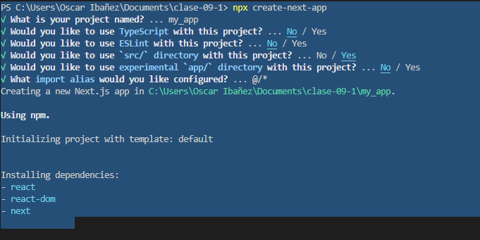

# clase-09
con framework de nextjs

# creamos proyecto de Reac con Next con las siguientes opciones.

* Crear un proyecto de React Next, limpiaro por completo(como este ejemplo) y ponerle una imagen de fondo (pantalla completa en el background)
